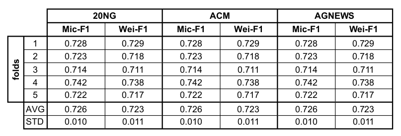

# Text Classification Benchmark based-on Fine-tuned Transformer

### 1. Quick Start

```shell script
# clone the project 
git clone git@github.com:celsofranssa/TeCBench.git

# change directory to project folder
cd TeCBench/

# Create a new virtual environment by choosing a Python interpreter 
# and making a ./venv directory to hold it:
virtualenv -p python3 ./venv

# activate the virtual environment using a shell-specific command:
source ./venv/bin/activate

# install dependecies
pip install -r requirements.txt

# setting python path
export PYTHONPATH=$PATHONPATH:<path-to-project-dir>/TeCBench/

# (if you need) to exit virtualenv later:
deactivate
```

### 2. Datasets
Downloading the datasets from [Kaggle Datasets](https://www.kaggle.com/celsofranssa/tecbench-datasets) 
(get kaggle credentials on [Kaggle API Docs](https://github.com/Kaggle/kaggle-api#api-credentials)):

```shell script
kaggle datasets download \
  celsofranssa/tecbench-datasets \
  -p resource/dataset/ \
  --unzip
```

Make sure that after completing the download of the datasets the file structure is as follows:

```shell script
TeCBench/
├── LICENSE
├── main.py
├── README.md
├── requirements.txt
├── resource
│   ├── dataset
│   │   ├── 20ng
│   │   │   ├── fold_0
│   │   │   │   ├── test.pkl
│   │   │   │   ├── train.pkl
│   │   │   │   └── val.pkl

        ...     

│   │   │   ├── fold_9
│   │   │   │   ├── test.pkl
│   │   │   │   ├── train.pkl
│   │   │   │   └── val.pkl
│   │   │   └── samples.pkl

        ..

│   │   └── yelp_2015
│   │       ├── fold_0
│   │       │   ├── test.pkl
│   │       │   ├── train.pkl
│   │       │   └── val.pkl

        ...

│   │       ├── fold_4
│   │       │   ├── test.pkl
│   │       │   ├── train.pkl
│   │       │   └── val.pkl
│   │       └── samples.pkl
│   ├── log
│   ├── model_checkpoint
│   ├── prediction
│   ├── representation
│   └── stat
├── settings
│   ├── data
│   │   ├── 20NG.yaml
│   │   └── YELP.yaml
│   ├── model
│   │   └── BERT.yaml
│   └── settings.yaml
└── source
    ├── callback
    │   └── PredictionWriter.py
    ├── datamodule
    │   └── TecDataModule.py
    ├── dataset
    │   └── TeCDataset.py
    ├── encoder
    │   └── BertEncoder.py
    ├── helper
    │   └── EvalHelper.py
    ├── model
    │   └── TeCModel.py
    └── pooling
        ├── AttentivePooling.py
        ├── AveragePooling.py
        ├── MaxPooling.py
        └── NoPooling.py
```


### 3. Test Run
The following bash command fits the BERT model over 20NG dataset using batch_size=128 and a single epoch.
```
python main.py tasks=[fit] model=BERT data=20NG data.batch_size=32 trainer.max_epochs=1
```
If all goes well the following output should be produced:
```
GPU available: True, used: True
[2020-12-31 13:44:42,967][lightning][INFO] - GPU available: True, used: True
TPU available: None, using: 0 TPU cores
[2020-12-31 13:44:42,967][lightning][INFO] - TPU available: None, using: 0 TPU cores
LOCAL_RANK: 0 - CUDA_VISIBLE_DEVICES: [0]
[2020-12-31 13:44:42,967][lightning][INFO] - LOCAL_RANK: 0 - CUDA_VISIBLE_DEVICES: [0]

  | Name     | Type        | Params
-----------------------------------------
0 | encoder  | BertEncoder | 108 M 
1 | cls_head | Sequential  | 15.4 K
2 | loss     | NLLLoss     | 0     
3 | f1       | F1          | 0     
-----------------------------------------
108 M     Trainable params
0         Non-trainable params
108 M     Total params


Epoch 0: 100%|███████████████████████████████████████████████████████| 5199/5199 [13:06<00:00,  6.61it/s, loss=5.57, v_num=1, val_mrr=0.041, val_loss=5.54]

```

### Benchmark Results


